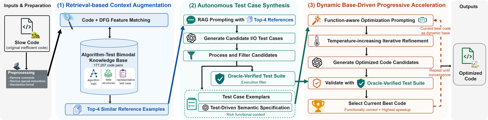

# FIPER

FIPER is a function-aware iterative framework for source-code optimization when
predefined tests are absent or limited. It combines algorithm-test retrieval,
oracle-verified test synthesis, a test-driven semantic specification, and progressive
optimization in which the fastest valid candidate becomes the next round's dynamic
base.

This repository is the replication package for the paper **"FIPER: Code Optimization
via Oracle-Verified Test Synthesis and Progressive Refactoring."** It contains the
experiment drivers, analysis utilities, and 20-row review samples. Full datasets,
generated programs, and the 177,207-instance retrieval knowledge base are hosted
separately because of their size.



## Artifact availability

| Artifact | Repository contents | Complete artifact |
|---|---|---|
| PIE and PEACEXEC datasets | The first 20 examples in `DataSet/` | [Full evaluation datasets](https://drive.google.com/drive/folders/1C1GVBfCzt62RB80adOyxgNV4fTbOvEdU?usp=sharing) |
| PEACEXEC configured virtual environments | Not included because of their size | [Virtual environment archive](https://drive.google.com/file/d/1UjOInbpW71Pp_98DrbaFsW6Vl-4cjwY-/view?usp=sharing) |
| Baseline-generated programs | Baseline implementations in `baselines/` | [All baseline-generated code](https://drive.google.com/drive/folders/1dHGtQULOvoOsVrumS_jkhSpkdXWaLeM1?usp=sharing) |
| Algorithm-Test Bimodal Knowledge Base | Retrieval and preprocessing code only | [Complete knowledge base](https://drive.google.com/drive/folders/19UhFmnSh26RTS8c5vw2RuY7I9Fzwqb3V?usp=sharing) |
| FIPER-generated programs | Generation and evaluation pipelines only | [All FIPER-generated code](https://drive.google.com/drive/folders/1rt9xpFtNrQtW68aEZcwSlxuqbbQTiyWx?usp=sharing) |


## Artifact map

| Path | Paper scope | Contents |
|---|---|---|
| `FIPER_RQ1/` | RQ1: zero public tests | Public tests are withheld from prompting, validation, profiling, and selection; FIPER is compared with seven baselines that do not require public-test feedback |
| `FIPER_RQ2/` | RQ2: limited public tests | Autonomous constraints augment the available public tests; FIPER is compared with the public-test-dependent Effi-Learner and SBLLM baselines |
| `FIPER_RQ3/` | RQ3: fine-grained distributions | NC/NO/NH/FH categorization and the four-panel distribution plot |
| `FIPER_RQ4/` | RQ4: component contributions | Core pipeline snapshot used for controlled ablation runs |
| `FIPER_PEACEXEC/` | Exploratory repository-level evaluation | Repository-level prompt generation, isolated worktree evaluation, and dynamic-base candidate selection |


## RQ1 and RQ2 protocol boundary

| Dimension | RQ1: zero public tests | RQ2: limited public tests |
|---|---|---|
| Public-test access | Deliberately withheld throughout generation, prompting, validation, profiling, and candidate selection | Available as limited feedback and combined with FIPER's autonomously synthesized constraints |
| Compared baselines | Instruction, ICL, RAG, COT, AutoPatch (C++), FasterPy (Python), and EffiSkill | Effi-Learner and SBLLM |
| Private tests | Used only for final held-out evaluation | Used only for final held-out evaluation |

The distinction concerns test accessibility, not dataset composition: the modified PIE
data contain public tests in both experiments, but RQ1 hides them from FIPER and every
RQ1 baseline. In RQ2, FIPER first completes autonomous test synthesis without public
tests and then combines the resulting constraints with the limited public tests during
candidate prompting and validation.

## Paper configuration

The principal settings implemented or exposed by the artifact are:

| Setting | Paper value |
|---|---:|
| Average public/private tests per PIE problem | 2.8 / 96 |
| Retrieved algorithm-test examples | Top 4 |
| Generated candidate test inputs | At least 50 |
| Maximum synthesized-input length | 256 tokens |
| Test Case Exemplars | 5 cluster outliers + 5 highest-load tests |
| Test-case generation temperature | 1.0 |
| Optimization candidates per round | 5 |
| Maximum progressive rounds | 4 |
| Optimization temperatures by round | 0.7 / 1.0 / 1.3 / 1.6 |
| Semantic-specification temperature | 0.01 |
| Maximum FIPER API calls per task | 22 (1 test + 1 specification + 20 optimization) |
| Warm-up executions | 1 discarded run |
| Measured executions | 25 runs |
| Python runtime used in the paper | CPython 3.13.7 |
| C++ runtime used in the paper | GCC 13.1.0, C++20, `-O3` |

The complete Oracle-Verified Test Suite is used as the execution filter. Only the ten
Test Case Exemplars are included in semantic-description and optimization prompts.
Private benchmark tests must remain inaccessible until final evaluation.


## Environment

The paper experiments ran on 64-bit Ubuntu 22.04 with a 64-core Intel Xeon Gold
6226R CPU at 2.90 GHz, an NVIDIA A100 80 GB GPU, and 256 GB RAM. Exact timing results
are hardware-sensitive; use an otherwise idle bare-metal machine for comparisons.

The paper's reported performance values use its calibrated in-memory dynamic-
compilation and reflection-based timing mechanism. The portable runners included in
this source artifact execute untrusted programs in isolated subprocesses. 

Create an environment and install the shared dependencies:

```bash
python3.13 -m venv .venv
source .venv/bin/activate
python -m pip install --upgrade pip
python -m pip install -r requirements.txt
```

For C++ experiments, install GCC 13.1 or a compatible compiler with C++20 support.
Local CodeLlama execution additionally requires PyTorch, Transformers, Accelerate,
and the selected checkpoint. Generated programs are untrusted; execute them only in a
network-isolated container or disposable worker with strict resource limits.

## Credentials

Only official model-provider clients are used. Supply comma-separated keys through
environment variables; never add credentials to CSV files or source code.

```bash
export OPENAI_API_KEYS="key-1,key-2"
export GOOGLE_API_KEYS="key-1,key-2"
export DEEPSEEK_API_KEYS="key-1,key-2"
```

Only the variable for the selected provider is required.

## RQ1: zero-public-test optimization

RQ1 compares FIPER with the seven methods that can run without public-test feedback:
Instruction, ICL, RAG, COT, AutoPatch for C++, FasterPy for Python, and EffiSkill.
Effi-Learner and SBLLM are excluded because their published procedures require public
tests. The repository driver enforces this boundary by dropping columns whose names
contain `public`, `private`, `hidden`, or the PIE-specific `Hide_IO` marker before
optimization.

Prepare a UTF-8 CSV containing `slow_code`. The recommended additional columns are
`problem_id`, `language`, and `reference_examples`. Retrieval examples must be drawn
from a problem-disjoint knowledge base and must never contain held-out evaluation
tests.

Inspect the pipeline without API or data access:

```bash
bash FIPER_RQ1/rq1_zero_public_tests.sh --dry-run
```

Run one model/language configuration:

```bash
INPUT_CSV=/data/pie/python_input.csv \
OUTPUT_DIR=/results/rq1/python_deepseek \
PROVIDER=deepseek \
MODEL=deepseek-chat \
LANGUAGE=python \
MEASURED_RUNS=25 \
bash FIPER_RQ1/rq1_zero_public_tests.sh
```

The driver creates auditable CSV checkpoints for synthesized inputs, the full
Oracle-Verified Test Suite, Test Case Exemplars, the semantic specification, all four
generated/evaluated/selected rounds, and `final_candidates.csv`.
When a round produces no valid candidate faster than the current base, that sample is
marked converged and subsequent model calls are skipped while the four-round audit
trail is preserved.

Optional retrieval preprocessing:

```bash
python FIPER_RQ1/retrieval/retrieve_examples.py \
  --queries /data/pie/python_input.csv \
  --knowledge-base /data/knowledge_base/python.csv \
  --output /data/pie/python_with_references.csv \
  --top-k 4
```

The query data require `slow_code` and `problem_id`; the knowledge base requires
`code`, `reference_tests`, and `problem_id`. If both files contain `dfg`, source-code
and DFG BM25 scores are fused. Any problem-ID overlap terminates the run.

## RQ2: limited-public-test optimization

RQ2 uses the same four-round progressive structure, but autonomously synthesized
constraints augment the small set of available public tests. Its paper comparison is
specifically against Effi-Learner and SBLLM, the two baselines that depend on public
tests for profiling, candidate selection, or iterative optimization. Private tests
remain evaluation-only.

```bash
DATA_DIR=/data/pie \
RESULT_DIR=/results/rq2 \
DATASET_ID=PIE \
LANGUAGE=python \
MODEL=DeepSeekChat \
MODEL_ID=deepseek-v3.2-exp \
bash FIPER_RQ2/rq2_four_rounds.sh
```

Set `BASELINE_PATH` when the input file does not follow the driver's default naming
scheme. `MODEL` identifies the downloaded dataset filename, while optional `MODEL_ID`
selects the provider model. Set `DRY_RUN=1` to print the complete command plan without
calling a model or writing result files. The original PIE schema should provide
`Slow_Code`, `4_Example_Prompt`, and `Public_IO_unit_tests__Dedup`.

Before the first model call, the driver removes every column marked private, hidden,
or `Hide_IO`. Test synthesis uses only the slow code and problem-disjoint retrieval
examples at temperature 1.0; the slow program then overwrites all proposed outputs to
form the Oracle-Verified Test Suite. The semantic specification uses only ten
synthesized representatives at temperature 0.01. Limited public tests are introduced
only for optimization prompting and candidate validation. Each round evaluates the
current base together with five candidates, prevents regression to an invalid or
slower program, and stops further model calls for a sample once no improvement is
found.

The dual-feature retrieval workflow is:

```bash
python FIPER_RQ2/knowledge_base_retrieval/graph_generation_unified/generate_dfg.py \
  --input-path /data/codes.csv \
  --output-path /data/codes_with_dfg.csv \
  --language python

python FIPER_RQ2/knowledge_base_retrieval/compute_similarity.py \
  --knowledge-base-path /data/knowledge_base.csv \
  --query-dataset-path /data/queries.csv \
  --output-directory /results/similarity \
  --language python

python FIPER_RQ2/knowledge_base_retrieval/attach_similarity_results.py \
  --knowledge-base-path /data/knowledge_base.csv \
  --query-dataset-path /data/queries.csv \
  --similarity-directory /results/similarity \
  --output-path /data/queries_with_retrieval.csv \
  --top-k 4 \
  --code-weight 2 \
  --graph-weight 1
```

## RQ3: fine-grained result distribution

`categorize_optimization_results.py` classifies each valid sample as:

- `NC`: generated code is incorrect or has an invalid runtime;
- `NO`: generated code is correct but does not satisfy the 10% OPT threshold;
- `NH`: generated code is optimized but does not outperform the human reference by 10%;
- `FH`: generated code outperforms the human reference by at least 10%.

Place strict JSON inputs in one directory using
`<python|cpp>__<method>.json`. Each file must contain these equally sized lists:
`slow_pass_rates`, `slow_runtimes_ms`, `human_pass_rates`, `human_runtimes_ms`,
`generated_pass_rates`, and `generated_runtimes_ms`.

To render the standard four-panel ordering from categorized data, use these method
identifiers: `instruction`, `icl`, `rag`, `cot`, `fasterpy` (Python) or `autopatch`
(C++), `effiskill`, `fiper_no_public`, `effilearner`, `sbllm`, and
`fiper_with_public`.

```bash
python FIPER_RQ3/categorize_optimization_results.py \
  --input-directory /results/rq3/raw \
  --output /results/rq3/categories.json

python FIPER_RQ3/plot_optimization_categories.py \
  --data /results/rq3/categories.json \
  --output /results/rq3/distribution.pdf
```

Omit `--data` to render the paper's reported Figure 8 values embedded in the plotting
script.

## PEACEXEC exploratory evaluation

The PEACEXEC input CSV uses the following English schema:

| Column | Meaning |
|---|---|
| `repo_path` | Repository path relative to `--repository-root` |
| `sha` | Baseline commit |
| `target_file` | Target file relative to the repository root |
| `target_class` | Enclosing class or an empty value |
| `target_func` | Function to optimize |
| `venv_path` | Environment path relative to `--venv-root` |
| `test_cmd` | Trusted project test command with timing instrumentation |
| `slow_code` | Original function definition |
| `test_code` | Relevant project test code |
| `semantic_description` | Added by the description stage |
| `current_code` | Optional validated dynamic base for the next round |

Generate semantic descriptions without contacting a provider:

```bash
python FIPER_PEACEXEC/generate_repository_candidates.py \
  --stage description \
  --input /data/peacexec/cases.csv \
  --output /results/peacexec/descriptions.csv \
  --dry-run
```

Generate five round-one candidates and evaluate them:

```bash
python FIPER_PEACEXEC/generate_repository_candidates.py \
  --stage optimize \
  --input /results/peacexec/descriptions.csv \
  --output /results/peacexec/round_1_generated.csv \
  --provider deepseek \
  --model deepseek-chat \
  --num-candidates 5 \
  --temperature 0.7

python FIPER_PEACEXEC/evaluate_repository_candidates.py \
  --input /results/peacexec/round_1_generated.csv \
  --output /results/peacexec/round_1_selected.csv \
  --repository-root /data/peacexec/repositories \
  --venv-root /data/peacexec/environments \
  --warmup-runs 1 \
  --measured-runs 25
```

The evaluator creates detached temporary Git worktrees and does not modify the source
clones. It updates `current_code` only when a functionally valid candidate has the
lowest measured runtime. Feed the selected CSV into the next optimization round and
increase the temperature by 0.3, up to four rounds.


